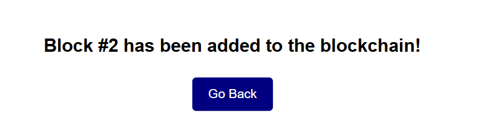
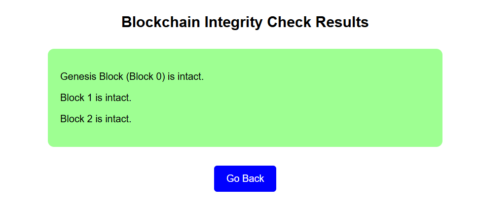

## Attendance Tracker Using Blockchain

---

#### Before You Begin
Here are some screenshots of the application:


*Home Page of the App*


*Select the class and subject whose data you want to add*


*Give attendance to each student*


*The block has been added to blockchain*


*Viewing the data of the block we just added*


*Checking the integrity of our blockchain*


*Visual representation of all the blocks and their data*

---
#### Running the application

- Run the python app
```
$ python blockchain.py
```
- Open a web browser and navigate to "http://localhost:5000" to use the application.

#### Copyright and License
Copyright (c) 2018 Adeen Shukla - Released under the MIT License
Copyright (c) 2024 Sahil Vartak - Released under the MIT License 

This project includes modifications made by Sahil Vartak: 
- Modified GUI for easy understanding of blockchain concepts
- Added a page for viewing the blockchain structure

The original project was created by Adeen Shukla. You can find the original project [here](https://github.com/adeen-s/Blockendance) .
